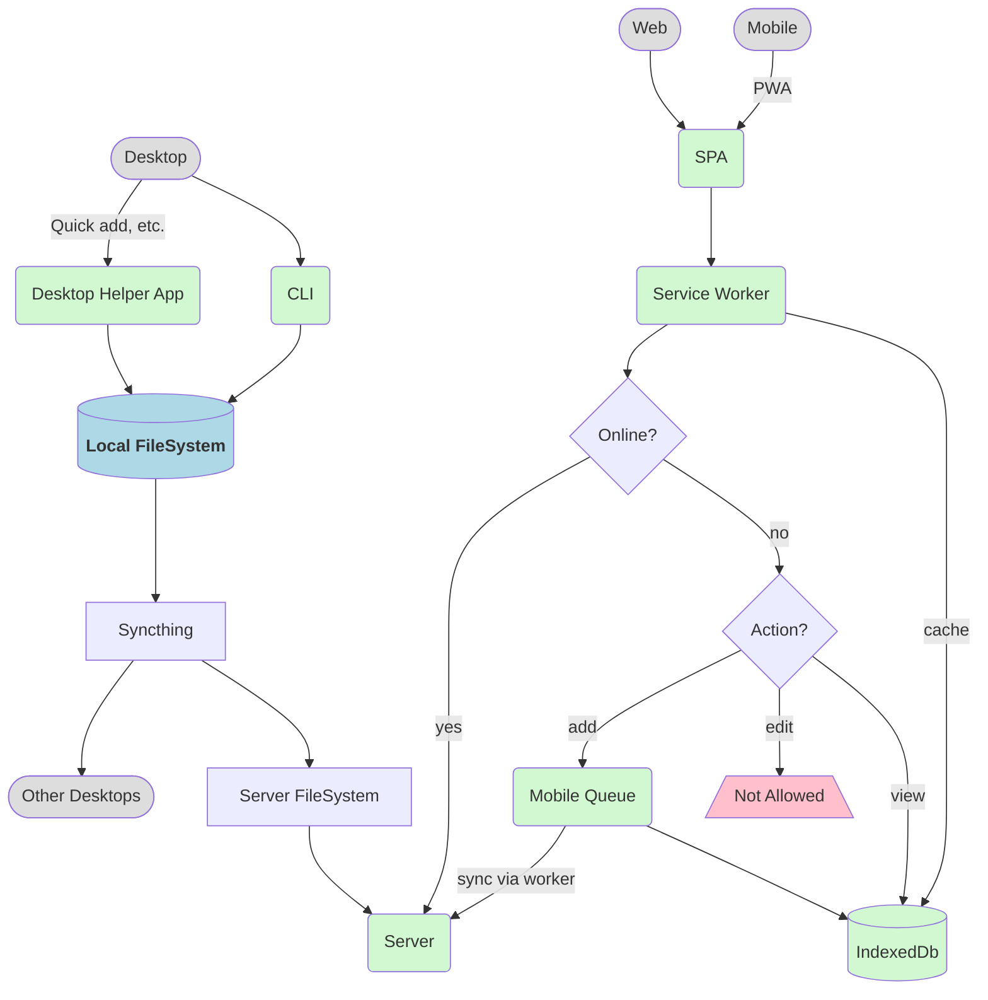

# Architecture

- Local filesystem as the source of truth.
- Sync with Syncthing
- **Let Syncthing deal with conflicts**
- PWA for web and mobile access
- Files as Json. Cached in IndexedDb for offline read access

## Order of Operations

TODO