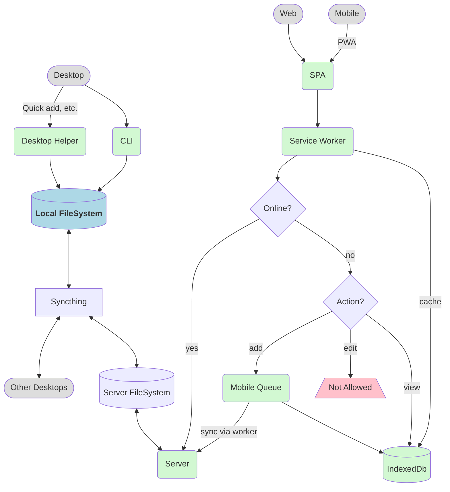

# Architecture

## File-based

- Local filesystem as the source of truth.
- Sync with Syncthing. **Let Syncthing deal with conflicts.**
- PWA for web and mobile access with IndexedDb caching for offline.
- Files represented over the wire and in IndexedDb as Json.



## Simplified

```mermaid
flowchart

	%% normal workflow
	web([Web]) --> spa(SPA)
	mobile([Mobile]) -- PWA --> spa
	spa --> worker(Service Worker)
	worker --> idb[(IndexedDb)]

	%% sync
	worker --> 
	online -- yes --> 
		
	style web fill:#ddd
	style mobile fill:#ddd

	style spa fill:#d2f8d2
	style worker fill:#d2f8d2
	style idb fill:#d2f8d2
```